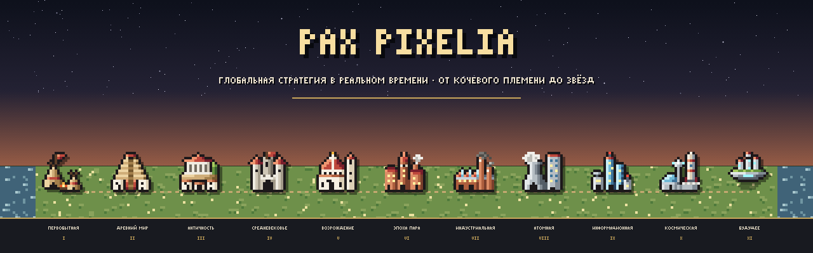
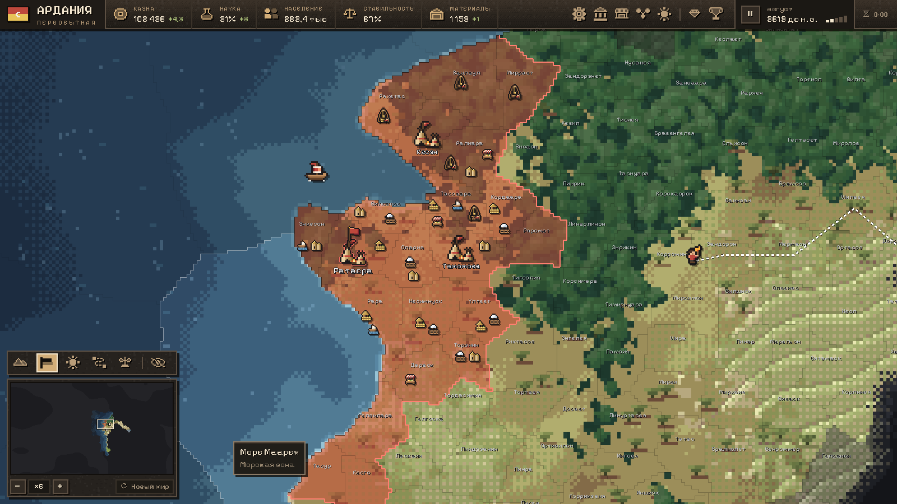
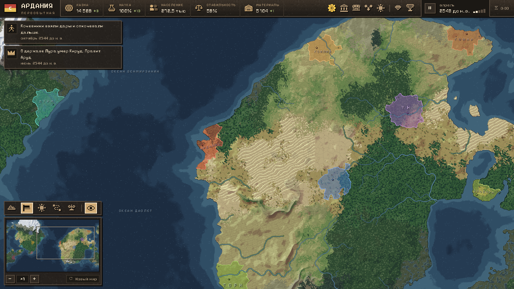
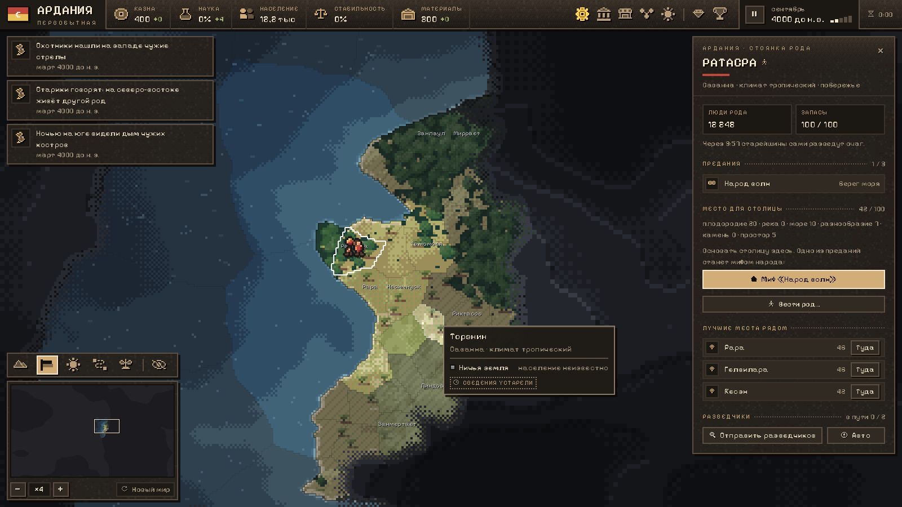
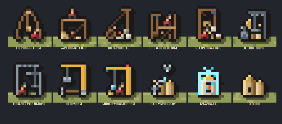
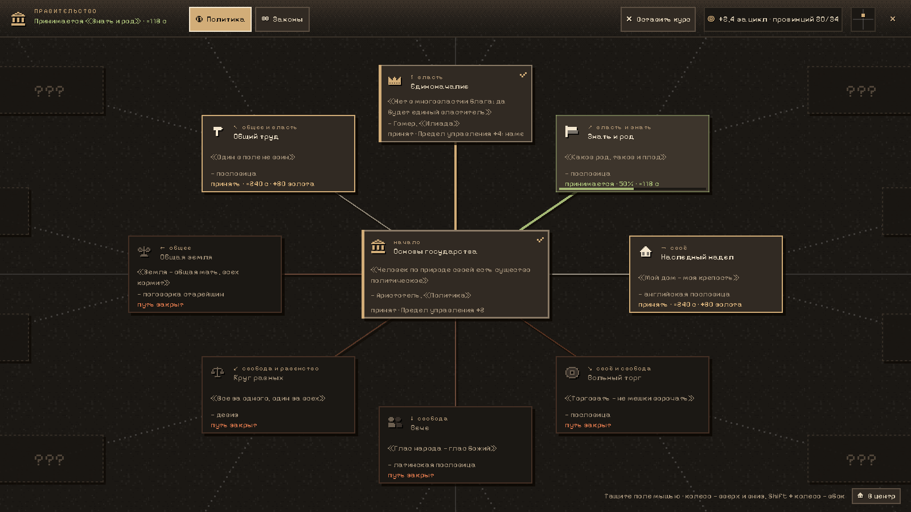
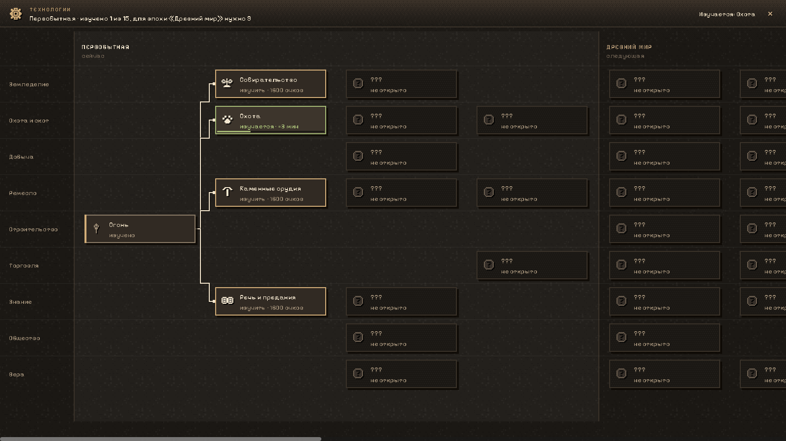
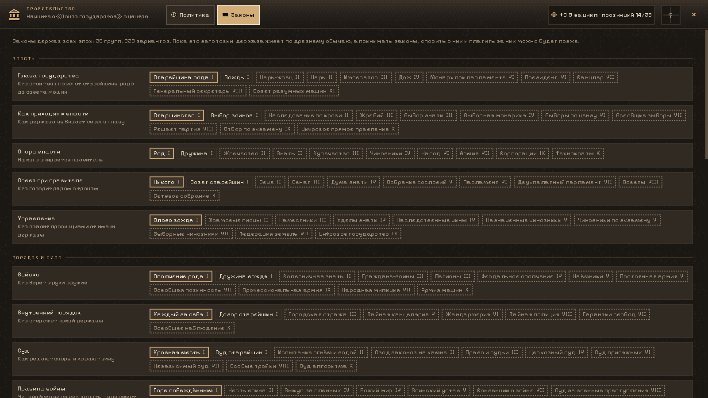
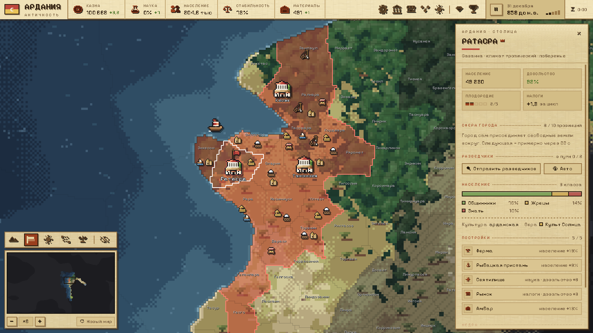

<div align="center">



<br>


### Пиксельная глобальная стратегия в реальном времени

**От кочевого рода у костра до колоний в космосе: одиннадцать эпох, живая карта, свой народ.**<br>
<sub><i>Real-time pixel grand strategy — from a nomad tribe to the stars.</i></sub>

<br>

[**Об игре**](#-об-игре) · [**Что уже есть**](#-что-уже-есть) · [**Эпохи**](#-одиннадцать-эпох) · [**Управление**](#-управление) · [**Запуск**](#-запуск) · [**Как устроено**](#-как-устроено) · [**Дорожная карта**](#-дорожная-карта)

</div>

<br>

<p align="center">
  
</p>

## 🏛 Об игре

> *«Огонь горит. Род цел. Идём.»*

**Pax Pixelia** — стратегия о пути народа сквозь века. Партия начинается с племени, которое бродит по неизведанной земле и ищет место для первого очага, а заканчивается в эпоху Будущего. Время течёт непрерывно, как в Hearts of Iron, пауза — в любой момент. Мир каждый раз новый, соседи — боты и, позже, живые друзья.

Здесь не нужно воевать, чтобы побеждать: державы соревнуются в эпохах, чудесах света, мировых первенствах, вере и славе. Каждое число в интерфейсе объясняет себя, а каждое решение что-то меняет в характере народа.

<br>

<table>
  <tr>
    <td width="50%"></td>
    <td width="50%"></td>
  </tr>
  <tr>
    <td><b>🌍 Мир каждый раз новый.</b> Около 6000 провинций, рельеф, реки, климат по эпохам, туман войны; мир замкнут по горизонтали.</td>
    <td><b>🔥 Начни кочевым родом.</b> Веди племя, собирай предания, оцени землю и разведи очаг: одно из преданий станет мифом народа.</td>
  </tr>
  <tr>
    <td width="50%"></td>
    <td width="50%"></td>
  </tr>
  <tr>
    <td><b>🏗 Стройка по эпохам.</b> Здание растёт на своём участке под лесами своего века: шалаш из жердей, кран с колесом, паровой кран, башенный кран, голограмма.</td>
    <td><b>⚖️ Правительство.</b> Дерево курсов на огромном поле, которое таскаешь мышью. От «Основ государства» к власти и свободе, к левым и правым.</td>
  </tr>
  <tr>
    <td width="50%"></td>
    <td width="50%"></td>
  </tr>
  <tr>
    <td><b>🔬 Технологии.</b> Одно дерево от «Огня». Видна только граница знаний, Великая развилка навсегда, озарения за дела.</td>
    <td><b>📜 Законы всех эпох.</b> 26 групп и 223 варианта: от старейшины рода до совета разумных машин, от кровной мести до суда алгоритма.</td>
  </tr>
</table>

## ✨ Что уже есть

<table>
  <tr><td>🧭</td><td><b>Разведка и юниты</b></td><td>Разведчики открывают карту. Отряд или род выбирается щелчком и идёт по правой кнопке, путь виден под курсором. Слухи о чужих народах тянутся дымом из-за облаков.</td></tr>
  <tr><td>💰</td><td><b>Экономика выбора</b></td><td>Налоги, материалы, содержание. Предел управления: держава сверх него платит и ворчит.</td></tr>
  <tr><td>🏗</td><td><b>Стройка</b></td><td>Здания встают не сразу, параллельная стройка дороже и медленнее. Проекты столицы, руда, геологи.</td></tr>
  <tr><td>🔬</td><td><b>Знания</b></td><td>40 технологий двух первых эпох и 30 озарений. Эпоха открывается знаниями, а не ожиданием.</td></tr>
  <tr><td>⚖️</td><td><b>Политика</b></td><td>Курсы по политическому компасу, положение державы на нём, заготовки законов всех веков.</td></tr>
  <tr><td>👑</td><td><b>Правитель и вера</b></td><td>Правитель с именем, возрастом и чертами, наследник и траур. Вера с догматами, обращение иноверцев.</td></tr>
  <tr><td>🎭</td><td><b>Характер народа</b></td><td>Пять шкал, которые растут от дел державы: общинный или вольный, набожный или светский…</td></tr>
  <tr><td>🔥</td><td><b>Беспорядки и мор</b></td><td>Ворчание, волнения, мятеж и отделение провинций; пустая казна; чума с иммунитетом.</td></tr>
  <tr><td>🤝</td><td><b>Дипломатия без войны</b></td><td>Мнения, дары, договоры, дань со слабых. Несчастная провинция уходит к соседу, у которого живут лучше.</td></tr>
  <tr><td>🏆</td><td><b>Слава</b></td><td>38 чудес света, по одному на мир. 9 мировых первенств. Вызов лидеру партии.</td></tr>
  <tr><td>🌦</td><td><b>Живая земля</b></td><td>Климат по годам: Зелёная Сахара, малый ледниковый период. Паводки ниже вырубок, вытоптанная степь.</td></tr>
  <tr><td>🏺</td><td><b>Археология</b></td><td>Руины древних народов ждут своего Возрождения.</td></tr>
  <tr><td>📖</td><td><b>Летопись</b></td><td>151 событие с выбором, нитями и пасхалками. Всё важное попадает в хронику державы.</td></tr>
  <tr><td>⚡</td><td><b>Блиц недели</b></td><td>Один мир на всех на неделю, таблица результатов и повтор чужих партий с честной проверкой.</td></tr>
  <tr><td>🎨</td><td><b>Пять обликов интерфейса</b></td><td>Интерфейс меняется вместе с эпохой: Костёр, Глина, Перо, Латунь, Сигнал.</td></tr>
  <tr><td>💾</td><td><b>Сохранения</b></td><td>Сохранение и автосохранение, совместимость со старыми версиями. Статус партии в Discord.</td></tr>
</table>

## 🕰 Одиннадцать эпох

<p align="center">
  
  <sub>Античность: интерфейс в облике «Глина», на стройках краны с колесом</sub>
</p>

<div align="center">

**Первобытная** → **Древний мир** → **Античность** → **Средневековье** → **Возрождение** → **Эпоха пара** → **Индустриальная** → **Атомная** → **Информационная** → **Космическая** → **Будущее**

<sub>Партия на «Обычной» скорости идёт около 25 часов. Глубже всего пока проработаны две первые эпохи.</sub>

</div>

## 🎮 Управление

<div align="center">

| Клавиша | Действие |
|:--|:--|
| **ЛКМ** | выбрать провинцию, отряд, кнопку |
| **ПКМ** | отправить выбранный отряд или род · отменить прицел |
| **Тащить мышью** | двигать карту и поле политики |
| **Колесо** · **+** / **−** | масштаб карты |
| **WASD** · **стрелки** | двигать карту |
| **Пробел** | пауза |
| **1 – 5** | скорость времени |
| **T** | технологии |
| **P** | правительство |
| **Esc** | назад: прицел → выбор → окно → панель → меню |

</div>

## 🚀 Запуск

Нужны **[Godot 4.7.1 .NET](https://godotengine.org/download)** и **[.NET 8 SDK](https://dotnet.microsoft.com/download/dotnet/8.0)**.

```bash
git clone https://github.com/ilovevodkaa/Pax-Pixelia.git
```

Открой `game/project.godot` в редакторе Godot и нажми **F5**. На Windows в корне репозитория есть ярлыки `Играть.bat` и `Редактор.bat`. Флаги командной строки для снимков и отладки описаны в [docs/DEV.md](docs/DEV.md).

<details>
<summary><b>🧪 Тесты</b></summary>

<br>

```bash
cd tests/SimTests && dotnet run -c Release
```

Симуляция без движка: больше 860 проверок, включая линтер детерминизма, повтор журнала, сохранения всех версий и темп эпох. Для полного отчёта о темпе добавь `-- pacing`.

```bash
cd tests/ContentTests && dotnet run -c Release
```

Контент: события и данные из `game/data`.

```bash
cd tests/WorldGenTests && dotnet run -c Release
```

Генератор мира: эталонные хеши миров.

В самой игре: `--selftest` (живой интерфейс), `--qa=…` (сценарии с настоящими щелчками мыши), `--savetest` (файлы сохранений).

</details>

## 🧠 Как устроено

- **Детерминированная симуляция.** Правила — чистый C# в `game/scripts/Sim`: только целые числа, своя хеш-случайность, никаких `float` и словарей. Линтер не даёт этому сломаться.
- **Всё — приказ.** Любое действие игрока — команда в журнале. Журнал воспроизводит партию бит в бит: на этом держатся повторы блица и будущий мультиплеер.
- **Сохранения с историей.** Формат снимка версионирован (сейчас v17), старые сохранения грузятся, а хеш состояния проверяет, что загрузилось ровно то, что сохранили.
- **Карта на шейдерах.** Провинции, туман, перекраска при захвате, реки и пути рисуют шейдеры. Города, здания и юниты берутся из одного атласа пиксельных спрайтов.
- **Пиксель-арт из кода.** Спрайты нарисованы ASCII-сетками в `docs/design/concepts/src`, генератор превращает их в C#. Цвета держав подставляются при запекании атласа.

<details>
<summary><b>📁 Структура репозитория</b></summary>

```
game/                 проект Godot
  scripts/Sim/        правила: экономика, эпохи, стройка, политика, вера… (детерминированно)
  scripts/Core/       связка с движком, сохранения, звук, Discord
  scripts/Map/        карта: шейдеры, спрайты, оверлеи
  scripts/UI/         интерфейс: панели, экраны, облики эпох
  scripts/World/      генератор мира
  data/               события, догматы, черты правителей
tests/                SimTests · ContentTests · WorldGenTests
docs/                 GDD, идеи, дорожная карта, арт-библия, DEV.md
```

</details>

## 🗺 Дорожная карта

- [x] **M0 — Карта и фундамент.** Мир, интерфейс, туман, разведчики, команды и журнал, целые числа.
- [ ] **M1 — Мирная песочница с ботами.** Эпохи, экономика, политика, вера, стройка, события. *Сейчас здесь.*
- [ ] **M2 — Онлайн с друзьями.** Партия до 16 держав по сети.
- [ ] **M3 — Война.** Полки из населения, фронты, осады, снабжение, оккупация.
- [ ] **M4 — Ранний доступ.** Страница в Steam.

Подробно — в [docs/ROADMAP.md](docs/ROADMAP.md), банк идей — в [docs/IDEAS.md](docs/IDEAS.md).

## 📜 Благодарности

- **Движок:** [Godot Engine](https://godotengine.org) (MIT), .NET (MIT).
- **Шрифт:** [Pixelify Sans](https://fonts.google.com/specimen/Pixelify+Sans) (SIL OFL 1.1), кириллица доработана для игры.
- **Звуки:** CC0 — [Kenney](https://kenney.nl), OwlishMedia, rubberduck, BigSoundBank.

<br>

<div align="center">


<sub>Сделано с любовью к картам и пикселям</sub>

</div>
