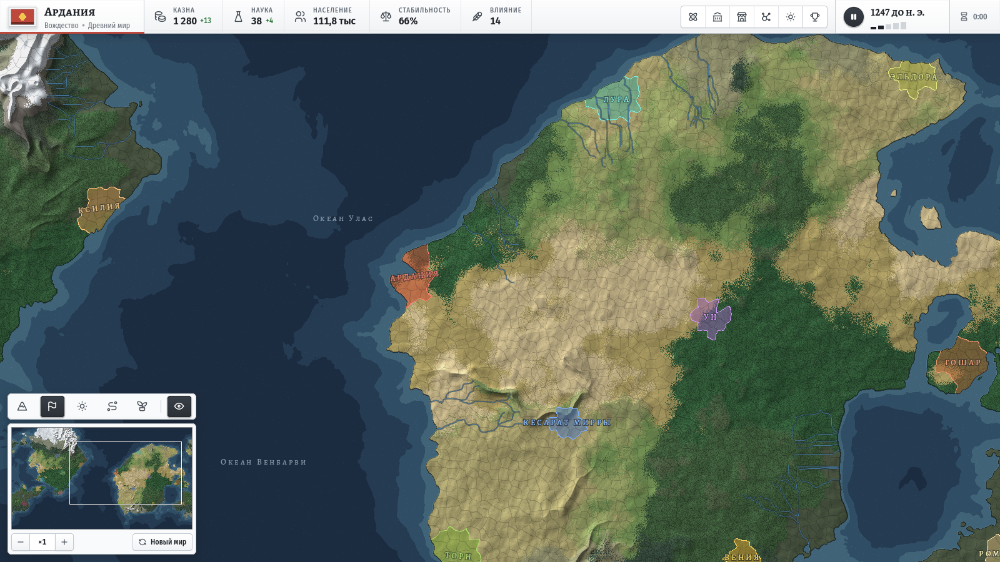
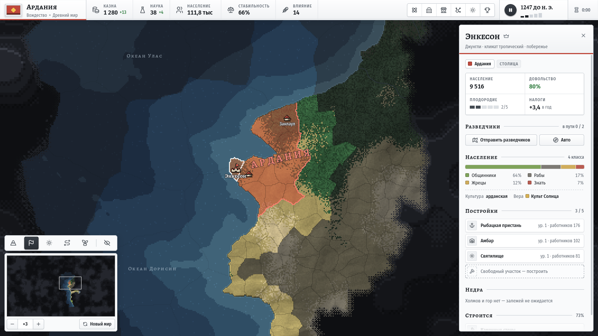
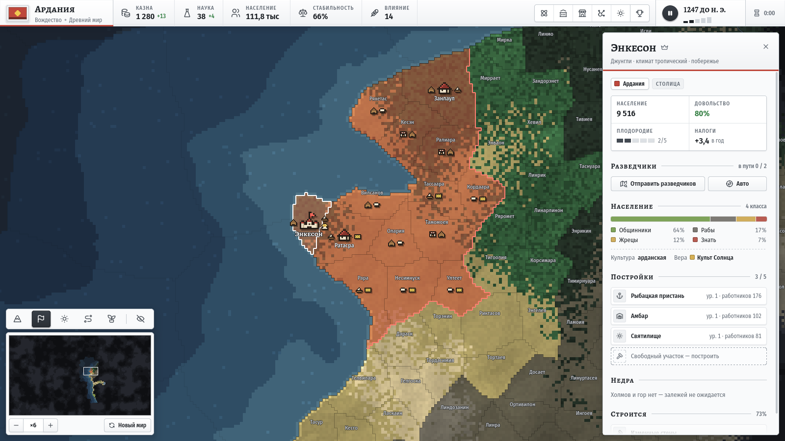
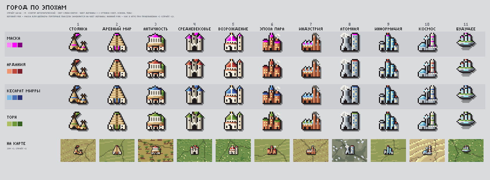

# Pax Pixelia

**Глобальная стратегия в реальном времени: от кочевого племени до звёзд**

*Real-time pixel grand strategy — from a nomad tribe to the stars*

## Об игре

Pax Pixelia — пиксельная глобальная стратегия о пути народа сквозь эпохи: от первых стоянок до космоса. Мир каждый раз новый, время течёт непрерывно, как в Hearts of Iron, пауза — в любой момент. Соседи — боты и живые друзья.

- **Процедурный мир.** Около 6000 провинций с рельефом, реками и климатом, мир замкнут по горизонтали.
- **Свой народ.** Имя, флаг и правителя выбираешь ты, а характер народа складывается из твоих решений.
- **Живое общество.** Население по классам, рынки, законы и религии.
- **Туман войны.** Мир приходится открывать разведчиками и торговыми путями.
- **Игра с друзьями.** До 16 держав на карте, мультиплеер в разработке.

<table>
  <tr>
    <td></td>
    <td></td>
  </tr>
</table>

  
  Город через 11 эпох: концепт пиксель-арта

## Статус

Ранняя разработка. Уже работают генерация мира, карта провинций, интерфейс, туман войны и разведчики. На очереди эпохи, экономика и онлайн, план — в [docs/ROADMAP.md](docs/ROADMAP.md).

## Запуск

Нужны **Godot 4.7.1 .NET** и **.NET 8 SDK**. Открой `game/project.godot` в редакторе и нажми F5. Подробнее — в [docs/DEV.md](docs/DEV.md).

## Стек

Godot 4.7 · C# (.NET 8) · карта на шейдерах · шрифты Alegreya SC и Fira Sans Condensed (SIL OFL)

Сделано с любовью к картам и пикселям

