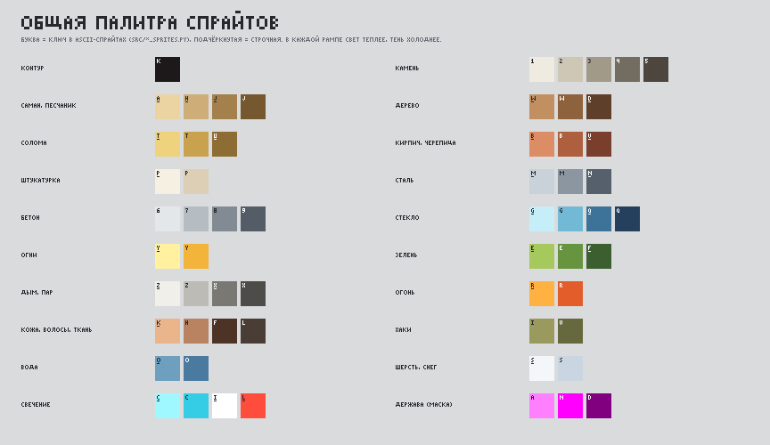
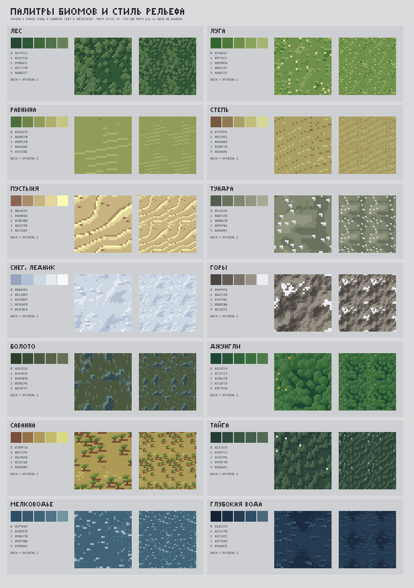
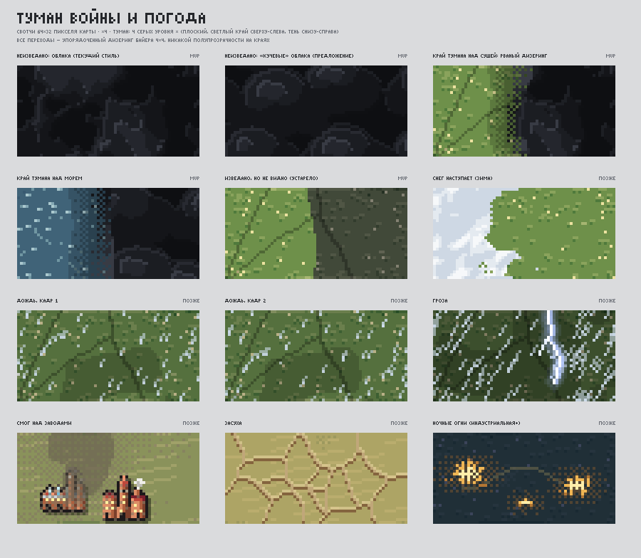
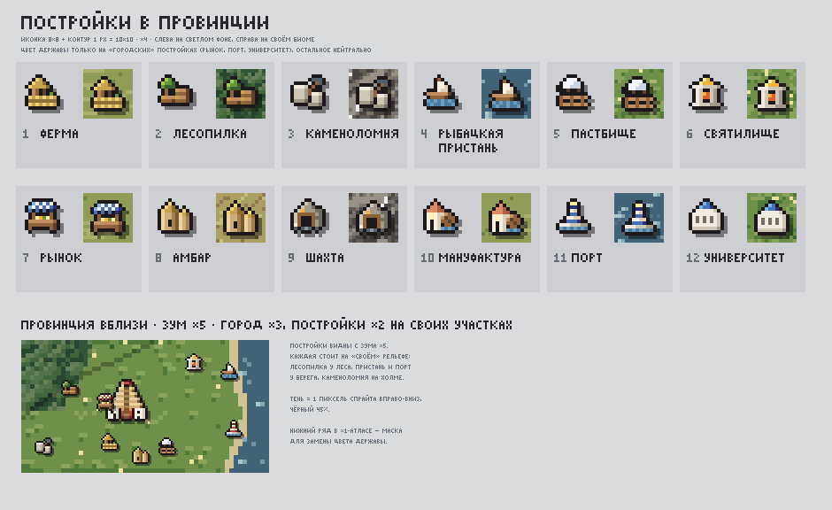
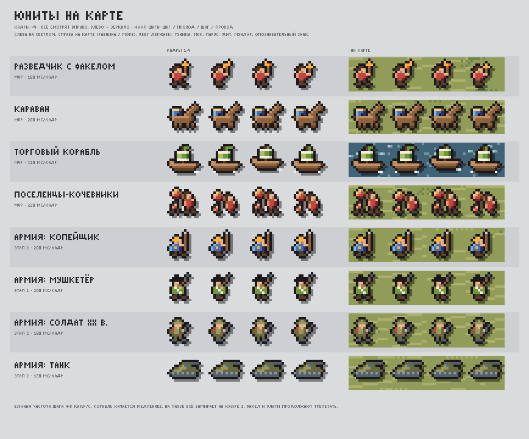
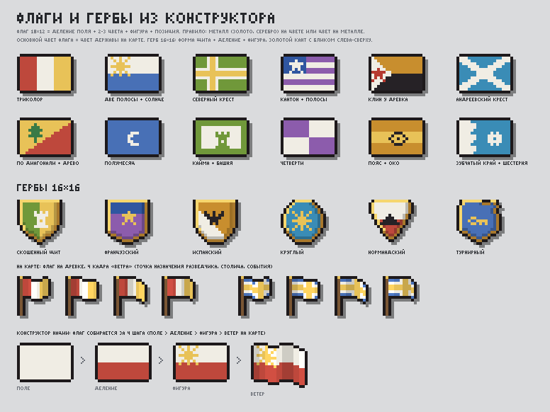

# Pax Pixelia — арт-библия карты и мира (v1)

Закон для всех агентов, которые рисуют карту, спрайты, туман и эффекты. Интерфейс описан отдельно, в «Мраморе и графите» ([SCREENS.md](SCREENS.md)). Источники: арт-направление мозгового штурма и концепт-листы из [concepts/](concepts/README.md). Все листы пересобираются командой `python docs/design/concepts/src/make_all.py` (≈5 с).

Визуал только **читает** состояние Sim. Случайность в нём берётся из своего хеша от `(сид, x, y, …)`, а не из `SimRng`, поэтому lockstep не ломается.

---

## 1. Направление: «цветная карта-макет под мраморным стеклом»

- **Земля приглушённая.** Рельеф с отмывкой от света сверху слева, постеризация до 5 тонов.
- **Всё рукотворное яркое:** тёмный контур 1 px `#1D191B` и тень на 1 px вправо-вниз (чёрный 45%). Любой объект читается на любом биоме.
- **Цвет державы — только акцент:** крыша, флаг, парус, туника, щит. Три тона со сдвигом оттенка, не больше ~15% пикселей спрайта.
- **Стены держат материал:** саман → мрамор → кирпич → бетон → стекло. Эпоха узнаётся по материалу и силуэту, держава — по цвету.
- **Детали — кластерами:** кроны, гребни дюн, камыш, пуфы облаков. Случайного шума по пикселю нет.
- **Переходы только дизерингом Байера 4×4** в узкой полосе и в мировых координатах. Полупрозрачных краёв и альфа-фейдов нет.
- **У каждой из 11 эпох свой силуэт,** узнаваемый даже на миникарте.



---

## 2. Правила палитры и света

| # | Правило | Числа |
|---|---|---|
| 1 | Свет сверху слева, как отмывка карты | `s = 1 + (gx+gy)·10`; освещены левая и верхняя грани |
| 2 | Рампа державы из 3 тонов | свет: тон на 13° к 60°, насыщенность ×0,78, яркость ×1,26; тень: тон на 14° к 252°, насыщенность ×1,08, яркость ×0,64 |
| 3 | Рампа биома из 5 тонов | яркость ×[0,70; 0,85; 1; 1,13; 1,26], насыщенность ×[1,10; 1,05; 1; 0,90; 0,78], тень −0,035 оборота на шаг к синему, свет +0,022 к жёлтому |
| 4 | Контур | `#1D191B`, 1 px, по 4 соседям. У дыма, пара, свечения и тени парящих объектов контура нет |
| 5 | Тень спрайта | силуэт со сдвигом (+1, +1) пиксель спрайта, чёрный 45% |
| 6 | Маска державы в атласах ×1 | пурпурная рампа `#FF80FF / #FF00FF / #800080`, при загрузке заменяется рампой державы |
| 7 | Размер палитры | на всю карту не больше ~96 цветов (вопрос 37); одиночный пиксель — только как намеренный блик |
| 8 | Гребни и долины | на гребне +1 ступень, в узкой долине (локальный минимум в окне 5×5) −1 |

Примеры рамп держав: Ардания `#EF9670 / #BE483C / #7A202D`, Кесарат Мирры `#79B7E5 / #4870B6 / #283274`, Торн `#ACC063 / #70983A / #366120`.

### 2.1 Общая палитра спрайтов (60 цветов, `palette_x1.png`)

| Материал | Цвета (от света к тени) |
|---|---|
| Контур | `#1D191B` |
| Камень | `#EFEBE1 #CFC7B6 #A29A89 #736C60 #4C463F` |
| Саман, песчаник | `#ECD3A2 #CFAD78 #A4804C #75582F` |
| Дерево | `#C29060 #8E623C #5E3F29` |
| Солома | `#EED27E #C9A24F #8E6D35` |
| Кирпич, черепица | `#DC8D66 #AE5F3E #7A3F2C` |
| Штукатурка | `#F6F0E3 #DCCFB6` |
| Сталь | `#C9D1D9 #8C96A1 #56606C` |
| Бетон | `#E3E7E9 #B5BDC3 #828B94 #545D67` |
| Стекло | `#C6EEF8 #72B9D5 #3D7399 #25405D` |
| Огни | `#FFF1A0 #F2B43A` |
| Зелень | `#A6C95E #66943F #3B5F2F` |
| Дым, пар | `#F0EFEA #BCBBB5 #7A7873 #4E4C49` |
| Огонь | `#FFB241 #E35D2B` |
| Кожа, волосы, ткань | `#EAB58B #B98260 #4D3326 #4A3D35` |
| Хаки | `#9A9A5E #66683D` |
| Вода | `#6F9FBF #4A7AA0` |
| Шерсть, снег | `#F4F7FA #C9D6E2` |
| Свечение | `#9FF7FF #35CDE6 #FFFFFF #FF4D3D` |
| Держава (маска) | `#FF80FF #FF00FF #800080` |

### 2.2 Рампы биомов (`terrain_ramps_lut.png`, 5×14, строка = биом, столбец = ступень 0…4)

| Биом | 0 (тень) | 1 | 2 (база) | 3 | 4 (свет) |
|---|---|---|---|---|---|
| Лес | `#274732` | `#315736` | `#40663C` | `#527349` | `#668157` |
| Луга | `#34652F` | `#4F7A3C` | `#6E904A` | `#8AA35C` | `#A6B571` |
| Равнина | `#4E6D39` | `#6D8548` | `#909C58` | `#ADB06B` | `#C5C582` |
| Степь | `#775941` | `#917A52` | `#AAA064` | `#C0BF79` | `#D6D691` |
| Пустыня | `#8C6555` | `#AA8B6A` | `#C8B480` | `#E2D799` | `#FCFBB5` |
| Тундра | `#525E4D` | `#68725E` | `#808670` | `#949781` | `#A9A993` |
| Снег, ледник | `#96A4BC` | `#B2C0D4` | `#CED8E4` | `#E4EAF0` | `#F6F8FA` |
| Горы | `#4A4442` | `#625C56` | `#7A746C` | `#989286` | `#ECEEF2` |
| Болото | `#2B3E2B` | `#3A4B35` | `#4A5840` | `#58634B` | `#676F57` |
| Джунгли | `#1E4534` | `#275337` | `#306238` | `#3C6F3D` | `#4F7B4A` |
| Саванна | `#784F36` | `#927245` | `#AC9A56` | `#C2BC6B` | `#D9D984` |
| Тайга | `#273B35` | `#30473C` | `#3A5442` | `#445F49` | `#506A51` |
| Мелководье | `#2F4D64` | `#385970` | `#406378` | `#507486` | `#7096A2` |
| Глубокая вода | `#162234` | `#1C2C40` | `#253B52` | `#2F4D64` | `#4A687E` |

Светлый край ступени 4 у гор (`#ECEEF2`) — это снежная шапка на освещённых высоких склонах. Для остальных 4+ биомов GDD (коралловый риф, озеро, оазис, вулкан, фьорд, холмы) рампы строятся той же функцией `terrain_ramp` из `Data.BiomeColor`.



---

## 3. Технический каркас карты

### 3.1 Палитровая карта: индексы вместо цветов (R-1, M1)

Сейчас `WorldData.BaseColor` хранит готовый RGBA. Предлагается хранить индексы, а цвет собирать в шейдере из LUT.

| Текстура | Формат | Содержимое |
|---|---|---|
| `terr` | RGBA8, 2560×1440 | R — материал (биом или поверхность, до 64); G — ступень светотени 0…4; B — фаза анимации или полоса глубины воды; A — флаги (река, берег, крона) |
| `pid` | RG8 | id провинции = r + g·256 |
| `pdata` | RGBA8, 128×64 (8192 ≥ 5900) | 4 байта на провинцию: доля полей, доля вырубки, доля застройки, флаги/зима. Обновляется целиком (32 КБ) |
| `lut` | RGBA8 | x = ступень + 8·вариант (лето, осень, зима, засуха, ночь, гравюра), y = материал. Вариант «лето» = `terrain_ramps_lut.png` |
| `masks` | RGBA8, 2560×1440 | «очереди» появления: R — холод, G — распашка, B — вырубка, A — застройка |

```glsl
// только texelFetch — индексы нельзя фильтровать
int m  = int(T.r * 255. + .5);
int sh = int(T.g * 255. + .5);
COLOR  = texelFetch(lut, ivec2(sh + 8 * variant, m), 0);
```

- Ступень считается в `WorldBuilder`: `clamp(round((shade − 1)/0,15), −2, 2) + 2`.
- LUT собирается скриптом из рамп в PNG, чтобы палитру мог править человек в Aseprite.
- Миникарте и скриншотам нужна CPU-копия цвета через тот же LUT.
- Для отладки нужен режим «показать материал/ступень».
- Делать после волны 1, одним агентом карты. Формат WorldData при этом меняется.

### 3.2 Карта-летопись: маски-пороги (R-2, M1)

При генерации у каждого пикселя появляется «очередь» для нескольких процессов. Пиксель переключается, когда его очередь меньше доли провинции.

| Маска | Формула очереди (0…255) | Эффект |
|---|---|---|
| G — распашка | `255·clamp(0,55·d_центр/R + 0,25·(1−плодородие) + 0,2·кластерный_шум_4px)`, у реки −40 | поля расползаются от города вдоль рек |
| B — вырубка | `255·clamp(0,6·до_опушки/8 + 0,4·шум)` | лес редеет с опушек |
| A — застройка | `255·clamp(d_город/12 + 0,25·шум)` | пригород растёт кольцами |
| R — холод | `255·t` (температура генератора + кластерный шум 3 px) | снег, лёд (§7) |

**Откуда берутся доли (их считает Sim):**
- `поля` = занятые места ферм / ёмкость;
- `вырубка` — накопленная вырубка;
- `город` = `min(0,6, (население/10 000)/размер провинции)`.

Плавность даёт интерполяция доли на CPU за 0,5 с.

```glsl
if      (M.a < P.urban)             m = URBAN[era];
else if (isForest(m) && M.b < P.cut) m = STUMPS_GRASS;
else if (M.g < P.fields)            m = FIELD[era];
```

**Узор поля по эпохам** (тайл 16×16 в мировых пикселях):

| Эпоха | Узор |
|---|---|
| E1 Древний мир | лоскуты Вороного 3–6 px трёх тонов (пар, зелень, золото) |
| E2 Античность | квадраты центуриации 8 px с межами |
| E3 Средневековье | полосы трёхполья 1×8 px, направление 0° или 90° по хешу провинции |
| E4 Возрождение | бокаж: поля 6–10 px с живой изгородью в 1 px |
| E5–E6 | прямоугольники 12–16 px |
| E7 Атомная | в пустыне — круги полива r = 5 px |
| E10 Будущее | солнечные фермы: тёмно-синие полосы с бликом |

Позже той же техникой: пепел вулканов, гарь, засоление (доля, которая восстанавливается со временем).

### 3.3 Рельеф без «соли»: кластеры и глифы (R-3, M1)

Сейчас лес в цветовом проходе рябит: `hn<.3 → .78` на каждый пиксель. Меняем так:

- **Постеризация до 5 ступеней.** Дизеринг Байера только в полосе ±0,17 уровня у границы ступеней.
- **Глифы.** Расставляются Пуассон-диском при генерации:

  | Биом | Глиф | Мин. расстояние | Плотность |
  |---|---|---|---|
  | Лес | крона 2×2 (блик на СЗ, тень на ЮВ) | 2 px | 55% |
  | Тайга | ель 1×2 | 2 px | 60% |
  | Джунгли | крона 3×3 | 2 px | 80% |
  | Саванна | акация 3×1 с тенью | — | 4% |
  | Пустыня | гребни дюн с периодом ~8 px | — | — |
  | Болото | лужи с камышом | — | — |
  | Тундра | кочки | — | — |

  У границы биома плотность умножается на `smoothstep(0, 3 px)`, поэтому опушка мягкая, а не линия.
- **Вершины гор.** На локальных максимумах h > 0,72 (подавление в радиусе 6 px) ставятся пики 5×4 / 7×5 / 9×7 по высоте:
  - склон к СЗ +1 ступень, к ЮВ −2;
  - снежная шапка в 2 ряда;
  - тёмный контур только с ЮВ, чтобы не спорить с границами провинций.

### 3.4 Контракт пиксельной сетки и LOD (R-4, M1)

Три сетки и одно правило.
- **Мир** (рельеф, поля, дороги, горы, кроны): 1 тексел = 1 мировой пиксель.
- **Значки** (города, постройки, юниты): целочисленный масштаб, позиция снапается к экранному пикселю.
- **Текст:** векторные Alegreya SC и Fira Sans Condensed в родном разрешении, единственное исключение.
- **Правило:** никаких альфа-фейдов. Появление, исчезновение и смена LOD делаются растворением через Байер 4×4 за 200 мс.

| Зум | Город | Постройки | Юниты, караваны | Рельеф |
|---|---|---|---|---|
| ×1 | точка 3×3; столица — ромб 5×5 в цвете державы | — | точка 2×2 | ступени и кроны |
| ×2 | иконка 8×8 ×1 | — | ×1 | + дюны, камыш |
| **×3** (по умолчанию) | 16×16 ×2 | — | ×2 | + пики гор |
| ×4 | 16×16 ×3 | — | ×2 | + кромки мощёных дорог, шпалы |
| ×5 | 16×16 ×4 | 8×8 ×2 на якорях | ×3 | + мельницы, колёса |
| ×6 | ×5 | ×2 | ×3 | + хутора вдоль дорог |
| ×8 | ×6 | ×3 | ×4 | всё |

- **Город:** `ps = max(2, round(z·0,75))` с `MidpointRounding.AwayFromZero`.
- **Юниты:** `s = max(1, round(z/2))`, иконки растут медленнее рельефа, как в HOI4 (вопрос 31).
- **Постройки:** на листе [buildings.png](concepts/buildings.png) при зуме ×5 город нарисован ×3, а формула даёт ×4. Выбираем по контактному листу скриншотов.

Таблицу нужно записать в `docs/ART.md` вместе с примерами «можно/нельзя».

### 3.5 Камера

- **M1:** остаются ступени ×1…×8, как сейчас.
- **M2 (S-16): плавный зум с «жирными пикселями».**
  - Два прохода: карта в мировом разрешении в SubViewport (видимая область + 2 px), затем вывод шейдером sharp-bilinear: `px = s + clamp((px−s)/fwidth(px), −.5, .5)`.
  - Зум идёт в логарифмическом пространстве за 160 мс, точка под курсором стоит на месте.
  - Инерция `v *= exp(−6·dt)`. В покое камера встаёт на целый зум и целый пиксель.
  - Границы рисуются во втором проходе в экранных пикселях: провинция 1 px, держава 2 px (внешняя линия тёмная, внутренняя в цвете державы).
  - На шве по X видимая область собирается из двух кусков.

---

## 4. Эволюция карты по эпохам

По GDD 9.2 при смене эпохи меняются спрайты и карта, а интерфейс и музыка остаются. Значит, ощущение эпохи несёт карта. **Провинция рисуется в эпохе своего владельца** (вопрос 26), поэтому отстающего соседа видно глазами. Цветокор эпохи очень лёгкий: ±5% насыщенности и ±3° оттенка.

| # | Эпоха | Дороги | Поля | Город (силуэт) | Ночной свет | Трафик | Особое |
|---|---|---|---|---|---|---|---|
| 1 | Первобытная | тропа пунктиром (−1 ступень рельефа, шахматка) | нет | два типи, костёр, вымпел | редкие костры `#FF9A3C` | носильщики, плоты | мамонты, дымок в 2 кадра |
| 2 | Древний мир | грунтовка 1 px `#8A6C46` | лоскуты Вороного | ступенчатый зиккурат, белёные дома | костры | ослы, верблюды, галеры | глинобитные дома |
| 3 | Античность | мощёная `#B3A58A` с кромкой при z≥4 | центуриация | храм с фронтоном, кипарис, черепица | факелы | повозки, триремы | акведуки |
| 4 | Средневековье | грунт + мощёные | полосы трёхполья | донжон, башни с конусами, стена | факелы `#FFC36B` | обозы, коги | мельницы, замки |
| 5 | Возрождение | + каналы | бокаж | купол с ребром и фонарём, кампанила | фонари | каравеллы | верфи |
| 6 | Эпоха пара | рельсы `#3B3430`, шпалы через 3 px при z≥4 | прямоугольники | часовая башня, кирпич, светящиеся окна, пар | газовые фонари | паровозы, пароходы с дымом | первый смог |
| 7 | Индустриальная | сеть рельсов | крупные прямоугольники | фабрика с шедовой крышей, трубы | натрий `#FFA640` | составы | смог, серый снег, пик вырубки |
| 8 | Атомная | шоссе 2 px `#5F5F63`, разметка `#D6C46A` при z≥6 | круги полива | градирня с паром, панельная высотка | натрий | самолёты с инверсионным следом | плотины, АЭС |
| 9 | Информационная | шоссе | солнечные фермы | стеклянные башни, мачта с красным огнём | LED `#D9ECFF` | контейнеровозы | очистка воды |
| 10 | Космическая | шоссе | — | ракета на старте, стеклянный купол, игла | LED | спутники по синусоиде | запуски |
| 11 | Будущее | маглев `#B8E8FF` с бегущим импульсом | зелёные пустыни | парящий диск-аркология с садами | неон `#7DF9FF` / `#FF6AD5` | дроны | управляемая погода |


---

## 5. Вода, берега, реки (S-16, M2)

Вода — 63% карты, поэтому она должна жить.

- **Цикл палитры.** Для воды `B = (полоса глубины << 4) | фаза`, фаза — хеш 0…15 кластерами 3×3. Время `anim_t` идёт ступенями по 6 в секунду.
  - Мелководье: +1 ступень, если `(phase+step) % 8 == 0`.
  - Пена у берега: на пикселях с `distToLand = 1`, если `(phase+step) % 6 < 2`.
- **Полосы глубины:** берег `#507486`, мелко `#406378`, средне `#2F4D64`, глубоко `#253B52`, бездна `#1C2C40`, блик `#9CC3D0`.
- **Реки — растром, а не векторной линией.**
  - Ширина `1 + (flow > F1) + (flow > F2)`, где F1 и F2 — квантили потока 40% и 80%.
  - Ядро `#4D7FA6`, тёмный берег `#2F4F66` только при ширине ≥2.
  - Светлый пиксель бежит вниз по руслу ~3 px/с.
  - Водопад: перепад высоты > 0,08 на 2 px, 2 кадра пены.
  - Дельта при flow > F2: 2–3 рукава и веер `#6F9AA8`.
- **Берега:** пляж (t > 0,45 и уклон < 0,05) — 1–2 px песка; обрыв (высота у берега > 0,3) — 1 px тени без пены.
- **Лёд:** на море при `seaT < snowline − 0,08`, растёт от берега.

Переход рек из векторов в растр затрагивает `WorldBuilder.Rivers` и `RiverMesh`, поэтому делать его одним агентом. Вся анимация живёт в мировых координатах, чтобы при панораме не было ряби.

---

## 6. Туман войны (R-6, M1)



| Состояние | Вид | Техника |
|---|---|---|
| Неизведано | **кучевые облака-пуфы** (предложение художника) | На кластер: широкий пуф уровня 1, «корона» из 3–5 пуфов уровня 2 и 1–2 яркие верхушки уровня 3 со стороны света. Светлый ободок только по внешнему силуэту уровня. Сетка 26 px от сида мира, буфер половинного разрешения, как `fogT`. Дрейф на 1 px каждые 2 с реального времени. Тона `FOGP` из игры; верхнюю ступень попробовать `#4A4E59` |
| Край | рваная граница | Полоса Байера 9 px, шум ±8 px, затемнение в 2 ступени изнутри. «Кипение» 4 кадра/с только в полосе 6 px |
| Открытие | облака **прогорают** от разведчика | `revealT` 0→255 за 0,5 с на CPU. Облако, если `revealT < cloudNoise·255`. Кромка светлее на 1 px в полосе `[n−12, n]` |
| Изведано, устарело | **графитовая гравюра** (вопрос 30) | Яркость квантуется в 4 тона `#2A2D33 #4A4E56 #7D828B #B9BDC4`, в двух тёмных при z≥3 штрих `((x+y)&3)==0`. Пунктир последних известных границ. Запасной вариант — как сейчас: обесцветить на 60% и яркость ×0,6 |
| «Слышали» (карты из сделки) | **портолан** (вопрос 30; это 4-е состояние, нужно согласие) | Фон `#D9DCDF`, берег 1 px `#3A3F47`, реки `#6B8196`, названия графитом |
| Видно | полный цвет | — |

**Морские змеи.** Спрайт 12×6, 4 кадра. Всплывают примерно раз в 90 с в неизведанной морской зоне при z≤3, до Возрождения. Пропадают навсегда, когда изведано 50% океана.

---

## 7. Сезоны и погода

**Сезоны проявляются, когда время замедляется.** Если игровой год длится меньше ~6 реальных секунд, смена сезонов мигала бы как стробоскоп. Поэтому в древности карта показывает средний климат, а по мере сжатия времени мир начинает «дышать». Это видимая награда за прогресс.

```
secPerYear = 365 / (D × циклов_в_секунду)        // D — дней за цикл (IDEAS §0)
A          = smoothstep(6, 20, secPerYear)        // при смене скорости сглаживается за 2 с
winter(d)  = 0.5 + 0.5·cos(2π(d − 15)/365)        // в южном полушарии (y > H/2) сдвиг на полгода
snowline   = 0.08 + A·0.45·winter(d)              // пиксель снежный, если холод < snowline; ступень сохраняется
```

- **Когда видно.** На x3 сезоны появляются примерно с Эпохи пара, на x1 — со Средневековья.
- **MVP:** только постоянная климатическая снеговая линия. Полный цикл — в M2.
- **Эффекты:**
  - осень: вариант LUT «осень» для лиственного леса, дерево за деревом, если `hash(x,y)·40 <` дней после 10 сентября;
  - засуха: вариант LUT «сухой» для степи и саванны;
  - пояс тропических дождей: широта `0,08·H·sin(2π(d−80)/365)`.
- **Сезоны и игра.** Если зима должна влиять на урожай (вопрос 33), Sim считает свою детерминированную зиму по провинциям, а карта её только рисует.

**Погода — только значки и оверлеи событий, без слоя облаков** (облака погоды отброшены: их путают с туманом). Свотчи из `fog_and_weather.png` используются так:
- засуха — трещины на провинции;
- смог — бурый дизеринг `#847862`, гуще у труб, с Индустриальной;
- гроза и снегопад — только как VFX события;
- ночные огни — режим «Ночь» (§14).

---

## 8. Режимы карты (R-5, M1)

**Общие правила**
- Цвет режима просвечивает рельеф, светотень сохраняется: `out = mix(terr, modeCol·(0,75 + 0,1·(sh−2)), a(z))`.
- Сила тинта `a(z)` по зуму:

  | Зум | ×1 | ×2 | ×3 | ×4 | ×5 | ×6 | ×8 |
  |---|---|---|---|---|---|---|---|
  | a(z) | 0,80 | 0,72 | 0,56 | 0,45 | 0,38 | 0,32 | 0,28 |

- Незанятая суша обесцвечивается на 18%.
- Числовые шкалы (уровень жизни, цена, доступ) — 5 ступеней с дизером Байера между ними: `v·4 → ступень i, дробь f`; пиксель берёт ступень i+1, если `f > Bayer4(x,y)`. Плавных градиентов нет.
- **Смешанные провинции** (60% одной веры, 40% другой) рисуются не средним цветом, а упорядоченным дизерингом двух цветов. LUT P×1 RGBA8: R — индекс цвета A, G — индекс цвета B, B — доля B (0–255), A — флаги. Ниже ×2 показывается цвет большинства.
- Спорные территории и претензии — штриховка 45° `((x+y)>>1)&1` при z≥2.
- **Смена режима мгновенная.** Дизерная волна отброшена: она тормозит самое частое действие.

**Режимы MVP:** Рельеф, Политическая, Религия (+ символ веры 5×5 при z≥3), Торговля (маршрут с циклом цвета `#F0C860` / тёмный, 12 px/с), Плодородие, Классы, Уровень жизни, Недовольство, Доступ к рынку, **Эпохи** (11 цветов от охры `#8A6A48` до голубого `#7FD3FF`, сгруппированы в 4 тона, номер эпохи в тултипе).
**M2:** Цена товара (с выбором товара в легенде), Миграция (частицы между центрами провинций), Отношения, Выборы.

**Доступность (S-18):**
- 16 узоров-штриховок 8×8 для держав при z≥2;
- цвета держав из палитры, проверенной на дальтонизм, с максимальным ΔE2000 между соседями (раскраска графа);
- `tools/PaletteCheck` требует ΔE ≥ 12 при симуляции дейтеранопии и протанопии.

---

## 9. Подписи и топонимы (R-7, M1)

**Названия держав** (GDD 8) идут вдоль изогнутой оси территории. Алгоритм:
1. Компоненты территории → пиксели через `PixList` → ось по PCA.
2. Самый длинный отрезок вдоль оси по своим и водным пикселям (чужие обрывают).
3. Точки на 20/50/80% длины → перпендикуляры → их середины → квадратичная кривая Безье.

- **Кегль:** `fs = clamp(0,9·L/(n + (n−1)·ls), 12, 64)` экранных px, но не больше `0,6·толщины·z`.
- **Разрядка:** 0,22em для имён от 6 букв, до 0,5em для коротких.
- **Отрисовка:** глиф за глифом через `DrawSetTransform(pos, angle)`, Alegreya SC 700.
- **Цвет** (вопрос 36):
  - «гравировка» — `mix(цвет державы, #1B1E23, 0,65)`, α 0,85 и светлый блик 1 px снизу, будто буквы вырезаны в мраморе;
  - «макет» — светлый цвет державы и тёмная обводка `fs/6`.
- **Пересчёт:** debounce 0,5 с, только для затронутых держав. У анклавов и узких стран запасная прямая подпись.

**Иерархия по зуму**

| Зум | Что подписано |
|---|---|
| ×1–2 | державы, моря, хребты |
| ×3 | + столицы, пустыни |
| ×4–5 | + города, реки, провинции больше 160 px |
| ×6+ | все провинции |

Коллизии разрешаются жадно по приоритету.

**Атлас (S-16, M2).**
- Что подписываем: хребты (коричневые капители вдоль гребня), пустыни (охра, широкая разрядка), великие леса, моря и заливы (курсив, бледно-голубой), реки (мелко вдоль русла).
- Что считается объектом (определяет World): хребет — компонента h > 0,6 от 150 px; пустыня — от 400 px; лес — от 600 px.
- Имена даёт первооткрыватель в фонетике своей культуры (вопрос 27).

---

## 10. Поселения и постройки (R-8, M1)

### 10.1 Город

- Атлас `city_eras_x1.png` (176×64, клетка 16×16): ряды «маска, Ардания, Кесарат Мирры, Торн», 11 столбцов эпох.
- **Подмена цвета державы:** при старте пройти по атласам и заменить маску на рампу державы. Получится `ImageTexture` на державу, 16 × 11 × 16×16 ≈ 45 КБ. Вариант — шейдер с `uniform vec3 ramp[3]`.
- **Смена эпохи:** 3 кадра «вспышки» (белый силуэт → новый спрайт), волна от столицы (§13).
- **Размеры** (нужно дорисовать): деревня 12×12, город 16×16, столица 16×16 + флаг + тонкий ободок цвета державы. Позже (L) — процедурная сборка из модулей: доминанта эпохи в центре, дома культуры по спирали, стены, 7 размеров по населению (<1 тыс., 1–5, 5–20, 20–100, 100–500 тыс., 0,5–2 млн, >2 млн).
- **Культурные стили** (вопрос 34), в MVP 2 из 4:
  - северный — крутые скаты, дерево `#7A5634`;
  - южный — плоские крыши, белёные стены `#E8DCC4`;
  - степной — юрты, потом купола;
  - восточный — изогнутые крыши.

  Сначала через подмену рампы материала, силуэты — позже.
- **Пригород** растёт на земле через маску застройки (§3.2). На ×1 мегаполис выглядит серым пятном, как на спутниковом снимке.

### 10.2 Постройки на своих участках



- **Иконки:** 12 штук 8×8 (с контуром 10×10) — ферма, лесопилка, каменоломня, рыбацкая пристань, пастбище, святилище, рынок, амбар, шахта, мануфактура с водяным колесом, порт с маяком, университет. Цвет державы только у «городских»: навес рынка, полосы маяка, купол университета.
- **Якоря** считает World при генерации: 6–8 точек Пуассона на провинцию, отступ ≥3 px от границы и ≥6 px друг от друга, у каждой записан биом. Лучшие места:
  - ферма — ровный плодородный пиксель;
  - лесопилка — опушка;
  - каменоломня и шахта — склон;
  - пристань и порт — берег;
  - мельница — река;
  - рынок и святилище — у центра.

  Если подходящего пикселя нет, берётся ближайший к центру.
- **Отрисовка:** `MultiMeshInstance2D`, не больше ~2000 видимых. Стройка — леса своей эпохи в 4 кадра (`site_sprites.py`, 10×12 + контур), значок здания под ними растёт снизу вверх; по окончании — облачко пыли. Простой — серый спрайт.
- **Хутора** (M2): `clamp(население/2000, 0, 12)` домиков 2×2 на пикселях дорог и полей при z≥6.

---

## 11. Юниты и движение



| Юнит | Размер | мс/кадр | Этап | Цвет державы |
|---|---|---|---|---|
| Разведчик с факелом | 8×10 | 180 | MVP | туника (факел мерцает отдельно) |
| Караван (мул с тюками) | 12×10 | 200 | MVP | ткань тюков |
| Торговый корабль (ког) | 12×11 | 320 | MVP | парус, вымпел |
| Кочевники-поселенцы | 12×10 | 220 | MVP | узел, туники |
| Копейщик | 8×10 | 200 | фаза 2 | круглый щит |
| Мушкетёр | 8×10 | 200 | фаза 2 | мундир |
| Солдат XX века | 8×10 | 180 | фаза 2 | повязка |
| Танк | 12×8 | 120 | фаза 2 | знак на башне |

- 4 кадра (шаг / проход / шаг / проход), все смотрят вправо, влево — зеркально. Кочевники и корабль покачиваются на 1 px.
- **На паузе** все стоят на кадре 1, но факелы и флаги трепещут: мир на паузе живой. Вода и облака замедляются до 25%.
- **Караваны на путях:** не больше 3 спрайтов на маршрут, скорость визуальная (6 мировых px/с), Sim от неё не зависит. Кадры идут по реальному времени, позиция — по игровому. Лимит ~300 видимых.
- **След корабля:** 3 прошлые позиции становятся пиксельной пеной, которая гаснет дизером за 1 с.
- **Вид по эпохам:** носильщики → ослики / верблюды / повозки → обоз → паровоз → грузовик → дрон; плот → галера → ког → каравелла → пароход → контейнеровоз.
- **Нужно дорисовать:** кадры «стоит» и «работает», разворот вверх и вниз у кораблей, кадр «зевок» (§13).

---

## 12. Флаги и гербы (R-10, M1)



- **Флаг 18×12** = деление поля (15 шаблонов) + 2–3 тинктуры из 9 геральдических и цвета державы + фигура (12: солнце, звезда, полумесяц, древо, башня, око, шестерня, гора, птица, колос, мечи, ключ) + позиция.
- **Правило тинктур** (металл на цвете, цвет на металле) проверяется автоматически. Если фигура сливается с фоном, она становится серебряной или чёрной.
- **`FlagSpec`** `{ division:byte, tinct:byte[3], charge:byte, pos:byte, chargeTinct:byte }` ≈8 байт. Рендер детерминированный, по сети уходит только спека. Одна спека рисует флаг 9×6 на карте, 18×12 в интерфейсе и ×4 в лобби.
- **Гербы 16×16:** 6 форм щита, деление и фигура, золотой кант. Для зверей нужна сетка 9×9 и 2–3 ручных силуэта.
- **Флаг на древке 9×6:** 4 кадра ветра, бегущая синусоида по столбцам в 2 ступени.
- **Взрослеющий герб** (S-17, M2): тотем → штандарт → щит → прямоугольный флаг. С Индустриальной форма зависит от законов: монархия — герб в центре, республика — полосы из тинктур, теократия — символ веры. Размеры по эпохам: E0–E1 — 2 цвета, 8×6; E2–E3 — 3 цвета, 12×8; E4–E6 — 4 цвета, 16×10; E7+ — 5 цветов, 24×16. Старые флаги хранятся в Книге державы.

---

## 13. «Сок» и VFX

| Момент | Анимация |
|---|---|
| Основание города | пыль 12×12, 6 кадров по 60 мс; флаг подпрыгивает по y −6, −2, −4, 0 px за 240 мс; кольцо от 0 до 24 мировых px за 600 мс, гаснет дизером |
| Расширение границы | пиксель берёт цвет новой державы, если `distToOldBorder/maxDist < progress + 0,3·Bayer`; progress 0→1 за 400 мс |
| Выделение провинции | «бегущие муравьи»: пунктир 2/2 px по контуру, сдвиг 8 раз в секунду |
| Наведение | яркость +8 / +11 / +14% в 3 ступени, 1 Гц |
| Смена эпохи | фронт 120 px/с от столицы; спрайты и вариант LUT меняются в момент прохода фронта; камеру у игрока не отнимаем |
| Пауза | `anim_speed` → 0,25 за 250 мс |
| Отдых (пасхалка) | после 2 ч сессии у разведчиков кадр «зевок», над столицей «Z z z» вместо дыма; после 3 ч гаснет костёр на иконке меню паузы; вечером LUT на 6% теплее |

**VFX событий** (каркас в M2, дальше по S на событие):
- чума — тинт `#8FA36A` с пульсом 2 с, миазмы 5×5;
- лава — клеточный автомат вниз по склону, 1 px за 0,2 с, цвета `#FFD36B → #FF7A2E → #B33A1F → #3A2F2E`;
- комета — голова 3×3 и хвост 40 px, 8 с;
- потоп — строго по высотам;
- пожар — фронт 2 px/с, гарь зарастает через маску вырубки;
- саранча — 50 боидов;
- эму — 3×4, 4 кадра.

На экране одновременно не больше 3 крупных эффектов. Что случилось, решает Sim; Map только рисует.

---

## 14. Позже: ночь, промышленный след, живая природа

- **Режим «Ночь»** (клавиша N, с Эпохи пара; до неё только огни столиц):
  - земля в тёмно-синие ступени `#0C1422…#27344A`;
  - горит ядро застройки (маска A < 0,5·доля застройки) и дороги с эпохи освещения;
  - цвет огней по эпохе владельца (§4), свечение — крест из 4 соседей на 50%, 3% пикселей мерцают;
  - в устаревших зонах показываются последние известные огни, приглушённо.

  Смена дня и ночи с терминатором отброшена.
- **Смог:** `pollution[p]` из Sim, бурые дизерные пятна, которые сносит ветром; цветение воды `#4F6B4A` у грязных берегов; серый снег. На «Политическом» режиме смог не больше 25%.
- **Дикая природа** (с выключателем, вопрос 35): стада по плотности `wild·(1−застройка)·(1−поля)·(1−загрязнение)`, не больше 40 на экране; клинья птиц осенью; киты с фонтаном; мамонты до Древнего мира (пасхалка при вымирании).
- **Таймлапс и фоторежим:**
  - Sim раз в УГ пишет снимок: владельцы и доли, ≈2–5 КБ дельтой;
  - тот же шейдер рендерит кадры в SubViewport 1280×720;
  - GIF кодируется своим LZW (≈250 строк C#), 640×360, 15 fps, ≤8 МБ на 20 с;
  - F12 — постер мира 5120×2880 с легендой и сидом.

---

## 15. Отброшено в арте

| Что | Почему |
|---|---|
| Облака погоды над картой | путаются с туманом, мешают читать |
| Смена дня и ночи с терминатором | в HOI4 её массово выключают; есть режим «Ночь» |
| Дизерная волна смены режима | тормозит самое частое действие |
| Орбитальный зум «карта → шар» | ломает камеру; глобус только в меню и лобби |

---

## 16. Процесс и проверка

1. **Скрипты — источник правды.** Спрайты хранятся как ASCII-сетки в `concepts/src/*_sprites.py`, атласы собираются одной командой. Ручная доводка в Aseprite допустима, если сохранены правила §2.
2. **Любая правка визуала** сопровождается сценарием в `tests/shots/shots.json` и просмотром `contact.png`. Золотые эталоны обновляются флагом `-Update`, только после просмотра.
3. **Чек-лист «можно/нельзя» для агентов:**
   - ✓ целочисленный масштаб;
   - ✓ дизер вместо альфы;
   - ✓ контур у рукотворного;
   - ✓ цвет державы ≤15%;
   - ✓ свет с СЗ;
   - ✗ плавные градиенты в режимах;
   - ✗ шум по пикселю;
   - ✗ дробный масштаб значков;
   - ✗ собственные цвета мимо палитры.
4. **Детерминизм.** Визуал не пишет в `GameState`. Всё «случайное» в Map берётся из хеша `(сид, x, y, t)`.
